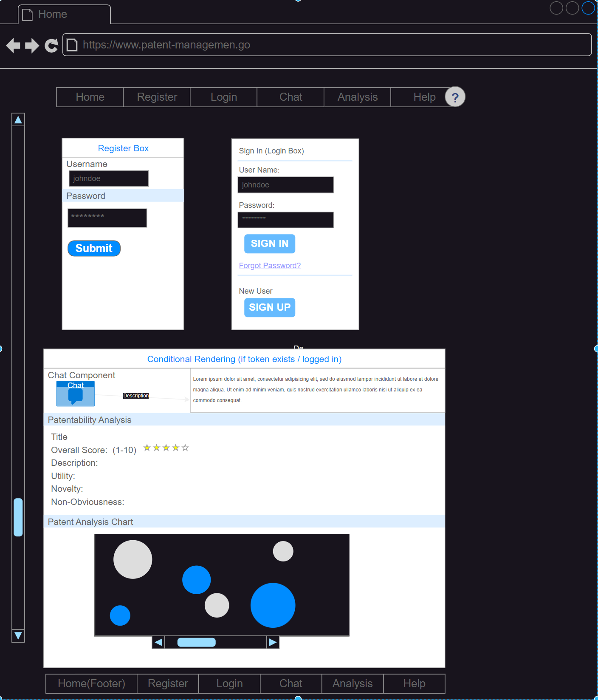
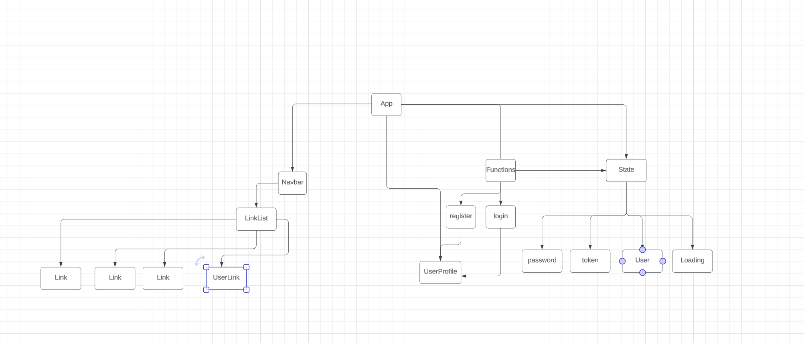
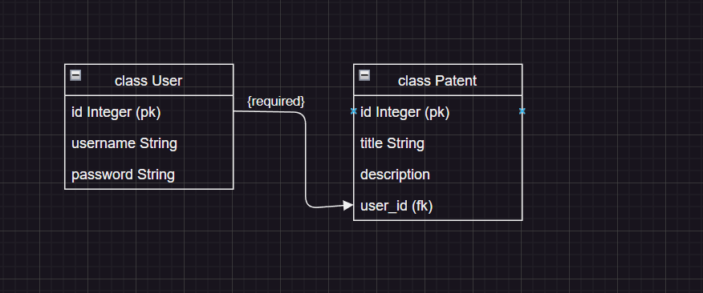

# Patent Management System

## Description
Patent Management System: A web application for managing patent registrations, conducting patentability analysis, and interacting with an AI-powered chatbot for patent-related queries.

## Wireframe

## Implement a minimum of 5 client side routes using React router.

+--------------------------------------------------+
| Header: Home | Register | Login | Chat | Analysis |
+--------------------------------------------------+
|                                                  |
|  +------------------+   +---------------------+  |
|  | Register Box     |   | Login Box           |  |
|  |------------------|   |---------------------|  |
|  | Username         |   | Username            |  |
|  | [TextField]      |   | [TextField]         |  |
|  | Password         |   | Password            |  |
|  | [TextField]      |   | [TextField]         |  |
|  | [Register Button]|   | [Login Button]      |  |
|  +------------------+   +---------------------+  |
|                                                  |
|  +--------------------------------------------+  |
|  | Conditional Rendering (if token exists)    |  |
|  |--------------------------------------------|  |
|  | Chat Component                             |  |
|  | PatentabilityAnalysis Component            |  |
|  | Patent Analysis Chart                      |  |
|  +--------------------------------------------+  |
|                                                  |
+--------------------------------------------------+
| Footer                                           |
+--------------------------------------------------+

## User Stories
1. **As a user, I want to register an account so that I can access the patent management system.**
2. **As a user, I want to log in to my account so that I can manage my patents.**
3. **As a user, I may have many patents, and a patent can have many users.**
4. **As a user, I want to create a new patent entry so that I can keep track of my inventions.**
5. **As a user, I want to analyze the patentability of my invention idea so that I can determine its novelty, non-obviousness, and utility. I want an overall patentability score based on these factors. I want a prior art search performed to generate data to support the patentabillity score.**
6. **As a user, I want to see a visual representation of my patentability score in the form of a patentability analysis chart/widget.**
7. **As a user, I want to chat with an AI-powered chatbot to get answers to my patent-related queries and to develop my patent application**

## React Tree Diagram

**Implement something new not taught in the curriculum.**
[Axios](https://axios-http.com/docs/api_intro)?
[Material UI](https://mui.com/material-ui/getting-started/)
**Implement [`useContext`](https://react.dev/reference/react/useContext) or [Redux](https://redux.js.org/)to manage State**

## Implement validations and error handling.

## App Component
- **State**:
  - `username`
  - `password`
  - `token`
  - `user`
  - `loading`
- **Functions**:
  - `register`
  - `login`
- **Children**:
  - `Typography` (Patent Management)
  - `Box` (Register)
    - `Typography` (Register)
    - `TextField` (Username)
    - `TextField` (Password)
    - `Button` (Register)
  - `Box` (Login)
    - `Typography` (Login)
    - `TextField` (Username)
    - `TextField` (Password)
    - `Button` (Login)
  - Conditional Rendering (if `token` exists)
    - `Chat`
    - `PatentabilityAnalysis`
    - `Box` (Patent Analysis Chart)
      - `Typography` (Patent Analysis Chart)
      - `Line` (Chart)

## Chat Component
- **Props**:
  - `token`
- **State**:
  - `message`
  - `response`
  - `patents`
- **Functions**:
  - `sendMessage`
- **Children**:
  - `h2` (Chat with GPT)
  - `textarea` (Message Input)
  - `button` (Send)
  - `div` (Response)
    - `h3` (Response)
    - `p` (Response Text)
  - `div` (Related Patents)
    - `h3` (Related Patents)
    - `ul` (Patent List)
      - `li` (Patent Item)
        - `h4` (Patent Title)
        - `p` (Patent Abstract)

## PatentabilityAnalysis Component
- **Props**:
  - `token`
- **State**:
  - `idea`
  - `analysis`
- **Functions**:
  - `submitIdea`
- **Children**:
  - `h2` (Patentability Analysis)
  - `textarea` (Idea Input)
  - `button` (Submit)
  - `div` (Analysis)
    - `h3` (Analysis)
    - `p` (Novelty)
    - `p` (Non-obviousness)
    - `p` (Utility)
    - `h4` (Relevant Precedents)
    - `ul` (Precedent List)
      - `li` (Precedent Item)

## Patent Application Tool

## Other Components
- **index.js**
  - Renders `App` component
- **reportWebVitals.js**
  - Measures performance

**Implement Flask and SQLAlchemy in an application backend.**

## Database Schema
**Implement a minimum of 4 models**
**Include a many to many relationship.**
**Implement validations and error handling.**

### Tables and Relationships

1. **User Table**:
   - `id`: Integer, Primary Key
   - `username`: String(64), Unique, Not Null
   - `password`: String(128), Not Null
   - Relationships:
     - `patents`: Many-to-Many relationship with the `Patent` table through the `user_patent` association table

2. **Patent Table**:
   - `id`: Integer, Primary Key
   - `title`: String(128), Not Null
   - `description`: Text, Not Null
   - `user_id`: Integer, Foreign Key to `User.id`, Not Null
   - `patentability_score`: Float
   - Relationships:
     - `user`: Many-to-Many relationship with the `User` table through the `user_patent` association table
     - `utility`: One-to-One relationship with the `Utility` table
     - `novelty`: One-to-One relationship with the `NoveltyTest` table
     - `obviousness`: One-to-One relationship with the `Obviousness` table
     - `prior_art`: One-to-One relationship with the `PriorArtSearch` table

3. **Utility Table**:
   - `id`: Integer, Primary Key
   - `operability`: Boolean
   - `beneficial`: Boolean
   - `practical`: Boolean
   - `utility_score`: Float
   - `patent_id`: Integer, Foreign Key to `Patent.id`
   - Relationships:
     - `patent`: One-to-One relationship with the `Patent` table

4. **NoveltyTest Table**:
   - `id`: Integer, Primary Key
   - `patented`: Boolean
   - `printed_pub`: Boolean
   - `public_use`: Boolean
   - `on_sale`: Boolean
   - `publicly_available`: Boolean
   - `patent_app`: Boolean
   - `inventor_underoneyear`: Boolean
   - `novelty_score`: Float
   - `patent_id`: Integer, Foreign Key to `Patent.id`
   - Relationships:
     - `patent`: One-to-One relationship with the `Patent` table

5. **Obviousness Table**:
   - `id`: Integer, Primary Key
   - `prior_art_scope`: String, Not Null
   - `differences`: String, Not Null
   - `skill_level`: String, Not Null
   - `secondary_considerations`: String
   - `obviousness_score`: Float
   - `patent_id`: Integer, Foreign Key to `Patent.id`
   - Relationships:
     - `patent`: One-to-One relationship with the `Patent` table

6. **PriorArtSearch Table**:
   - `id`: Integer, Primary Key
   - `elements`: String
   - `key_words`: String
   - `patent_search`: String
   - `publications`: String
   - `public_disclosures`: String
   - `patent_id`: Integer, Foreign Key to `Patent.id`
   - Relationships:
     - `patent`: One-to-One relationship with the `Patent` table

7. **user_patent Association Table**:
   - `user_id`: Integer, Foreign Key to `User.id`, Primary Key
   - `patent_id`: Integer, Foreign Key to `Patent.id`, Primary Key

### Validations

- **User Model**:
  - `username`: Must not be empty, must be at least 3 characters long
  - `password`: Must not be empty, must be at least 6 characters long

## Schema Screenshot
!Schema Screenshot

## API Routes
- Include full CRUD on at least 1 model, following REST conventions.
- Implement validations and error handling.
- Implement something new not taught in the curriculum.
`JSON Web Tokens (JWT)`
[Flask-JWT-Extended Basic Usage](https://flask-jwt-extended.readthedocs.io/en/stable/basic_usage.html)
## User Routes

| HTTP Method | Endpoint          | Description                  | Request Body                  | Response Body                |
|-------------|-------------------|------------------------------|-------------------------------|------------------------------|
| GET         | /users            | Get all users                | None                          | List of users                |
| GET         | /users/:id        | Get a specific user by ID    | None                          | User object                  |
| POST        | /users            | Create a new user            | `{ "username": "", "password": "" }` | Created user object          |
| PATCH       | /users/:id        | Update a specific user by ID | `{ "username": "", "password": "" }` | Updated user object          |
| DELETE      | /users/:id        | Delete a specific user by ID | None                          | Success message              |

## Patent Routes

| HTTP Method | Endpoint          | Description                  | Request Body                  | Response Body                |
|-------------|-------------------|------------------------------|-------------------------------|------------------------------|
| GET         | /patents          | Get all patents              | None                          | List of patents              |
| GET         | /patents/:id      | Get a patent by ID           | None                          | Patent object                |
| POST        | /patents          | Create a new patent          | `{ "title": "", "description": "", "user_id": "" }` | Created patent object        |
| PATCH       | /patents/:id      | Update a patent by ID        | `{ "title": "", "description": "", "user_id": "" }` | Updated patent object        |
| DELETE      | /patents/:id      | Delete a patent by ID        | None                          | Success message              |

## Patentability Analysis Routes

| HTTP Method | Endpoint                      | Description                                | Request Body                  | Response Body                |
|-------------|-------------------------------|--------------------------------------------|-------------------------------|------------------------------|
| POST        | /patentability/analyze        | Analyze patentability of an idea           | `{ "idea": "" }`              | Analysis result              |
| GET         | /patentability/:patent_id     | Get patentability analysis for a patent    | None                          | Patentability analysis       |

## Stretch Goals
1. **Implement user roles and permissions**: Allow different levels of access for users (e.g., admin, regular user).
2. **Add real-time notifications**: Notify users of important events, such as patent status updates.
3. **Integrate with external patent databases**: Automatically fetch and display relevant patent information from external sources.
4. **Provide a patent application writing tool**  Allow users to access a patent application writingwidget with possible AI integration for suggestions.

## Kanban Board
!Kanban Board

## New Technologies
- **Material-UI**: For styling and UI components.
- **React Bootstrap**: For responsive design and additional UI components.
- **Tailwind CSS**: For utility-first CSS styling.
- **Deployment**: Plan to deploy the application using platforms like Heroku or Render.
- **State Management**: Use React's [`useContext`]((https://react.dev/reference/react/useContext) ) or [Redux](https://redux.js.org/) for state management.
